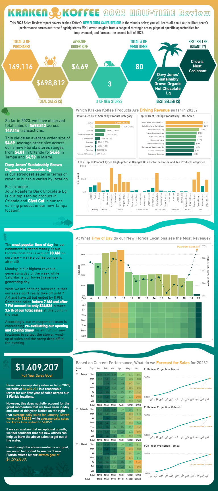

#  Kraken Koffee

This project is a guided project led by BI Lead Sean Chandler, a business intelligence professional with experience since 2014. It is second of four guided projects included in his Udemy course, [Microsoft Power BI Portfolio in a Day](https://www.udemy.com/course/microsoft-power-bi-portfolio-in-a-day/). 

## The Problem
Kraken Koffee, a fictional coffee company, needed to better understand its sales performance and uncover insights and opportunities for improvement for the three new Florida stores.  

The findings were consolidated into an infographic dashboard built in Power BI for quick and effective communication with stakeholders.

## What I Learned
I followed along with this guided project to gain insights into how an industry expert approaches dashboard design and storytelling with data.

From this project, I learned:
- Data Modeling & Structure
  - Organize DAX measures into tables for better maintainability
  - Separating the dataset into Fact and Dimension tables to follow a star schema design, making the data model easier to understand, scalable, and efficient for building measures.
- DAX & Calculations

  - `distinctcount()` - count discount number
  - `count()` - count number, since you know the column will be unique, this is more efficient
  - `RANKX()` - rank products based on sales
  - `ALLSELECTED()` - define the table or column context for calculations

- Dashboard Design & Visualization

  - Using an infographic layout to communicate insights at a glance

  - Building a heatmap using a matrix visual to highlight sales concentration and performance trends

## Dashboard Preview

